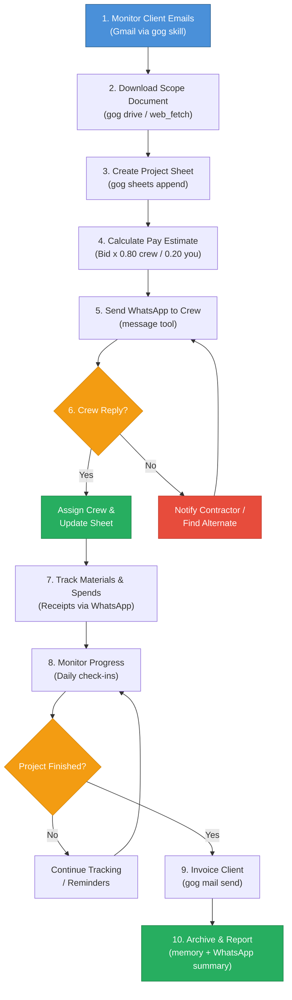

# Agent Guidelines for Contractor Workflow

## Best Practices
- _ALL_ planning should be done in .claude/plans/[plan-folder-short-desc]

## What We're Building

An automated construction contractor workflow powered by [OpenClaw](https://openclaw.com) on DigitalOcean. The agent monitors emails, extracts project data, tracks finances, coordinates crew via WhatsApp, and handles invoicing -- all autonomously.

## Workflow Flowchart



## OpenClaw Architecture Overview

The workflow maps to OpenClaw's component model as follows:

```
openclaw/
  config/
    openclaw.jsonc        # Main config (LLM, channels, skills, tools)
    cron/
      email-monitor.json  # Every 15 min -- triggers steps 1-5
      morning-briefing.json # Daily 7 AM -- contractor status summary
      progress-check.json # Daily 4 PM weekdays -- crew check-ins (step 8)
  workspace/
    SOUL.md               # Agent persona and principles
    IDENTITY.md           # Agent name and presentation
    USER.md               # Contractor profile and crew roster
    AGENTS.md             # Workflow logic (protocols for each step)
    TOOLS.md              # Tool usage conventions and rules
  memory/                 # Persistent project context across sessions
```

**Cron jobs** initiate the workflow. **Workspace files** give the agent its instructions and personality. **Tools and skills** (gog, message, memory, image, web_fetch) are the actions the agent can take.

## Workflow-to-OpenClaw Mapping

| Step | Workflow Action | OpenClaw Mechanism | Tools Used |
|------|----------------|-------------------|------------|
| 1 | Monitor Emails | Cron: `email-monitor` (every 15 min) | `gog mail list --unread` |
| 2 | Download Scope Doc | Agent turn within email-monitor | `gog drive download`, `web_fetch` |
| 3 | Create Project Sheet | Agent appends to Google Sheet | `gog sheets append` |
| 4 | Calculate Pay | LLM arithmetic (bid x 0.80 / 0.20) | `gog sheets update` |
| 5 | WhatsApp to Crew | Message to allowlisted numbers | `message` (WhatsApp) |
| 6 | Handle Crew Reply | Per-peer DM session | `message`, `gog sheets update` |
| 7 | Track Materials | Crew sends receipts via WhatsApp | `message`, `gog sheets append`, `image` |
| 8 | Monitor Progress | Cron: `progress-check` (4 PM weekdays) | `message`, `memory` |
| 9 | Invoice Client | Agent drafts email with itemized list | `gog mail send`, `gog sheets read` |
| 10 | Archive & Report | Summary to memory + WhatsApp | `memory`, `message`, `gog sheets update` |

## Integration Dependency Matrix

| Integration | Required For Steps | Setup Requirement |
|-------------|-------------------|-------------------|
| Gmail (gog) | 1, 2, 9 | Google Cloud OAuth + `gog auth` |
| Google Sheets (gog) | 3, 4, 6, 7, 9, 10 | Same OAuth as Gmail |
| Google Drive (gog) | 2 | Same OAuth as Gmail |
| WhatsApp | 5, 6, 7, 8, 10 | `openclaw channels login --channel whatsapp` |
| Memory | 8, 10 | Built-in, no extra setup |
| web_fetch | 2 | Built-in, no extra setup |
| image | 7 | Built-in, no extra setup |

## Configuration File Reference

| File | Purpose | Docs |
|------|---------|------|
| `.env.example` | All placeholder values in one place | Copy to `.env`, fill in |
| `config/openclaw.jsonc` | Main OpenClaw config template | Copy to Droplet |
| `config/cron/*.json` | Three cron job definitions | Copy to Droplet |
| `workspace/*.md` | Agent workspace files (5 files) | Copy to Droplet |
| `templates/*.md` | Message and sheet templates (reference only) | Used by agent logic |
