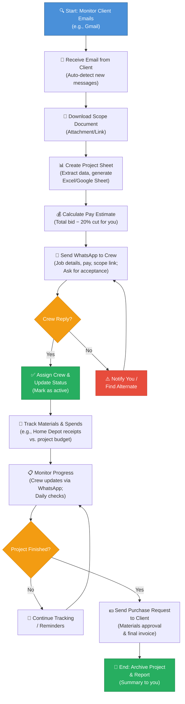

# Agent Guidelines for Contractor Workflow

## What we're building

```mermaid
flowchart TD
    A["🔍 Start: Monitor Client Emails<br>(e.g., Gmail)"] --> B["📩 Receive Email from Client<br>(Auto-detect new messages)"]
    B --> C["📎 Download Scope Document<br>(Attachment/Link)"]
    C --> D["📊 Create Project Sheet<br>(Extract data, generate<br>Excel/Google Sheet)"]
    D --> E["💰 Calculate Pay Estimate<br>(Total bid − 20% cut for you)"]
    E --> F["📱 Send WhatsApp to Crew<br>(Job details, pay, scope link;<br>Ask for acceptance)"]
    F --> G{"Crew Reply?"}

    G -- Yes --> H["✅ Assign Crew &<br>Update Status<br>(Mark as active)"]
    G -- No --> I["⚠️ Notify You /<br>Find Alternate"]
    I --> F

    H --> J["🧾 Track Materials & Spends<br>(e.g., Home Depot receipts<br>vs. project budget)"]
    J --> K["📋 Monitor Progress<br>(Crew updates via WhatsApp;<br>Daily checks)"]
    K --> L{"Project Finished?"}

    L -- No --> M["🔄 Continue Tracking<br>/ Reminders"]
    M --> K
    L -- Yes --> N["💵 Send Purchase Request<br>to Client<br>(Materials approval<br>& final invoice)"]

    N --> O["📁 End: Archive Project<br>& Report<br>(Summary to you)"]

    style A fill:#4A90D9,color:#fff,stroke:#2C5F8A
    style O fill:#27AE60,color:#fff,stroke:#1E8449
    style G fill:#F39C12,color:#fff,stroke:#D68910
    style L fill:#F39C12,color:#fff,stroke:#D68910
    style I fill:#E74C3C,color:#fff,stroke:#C0392B
    style H fill:#27AE60,color:#fff,stroke:#1E8449
```